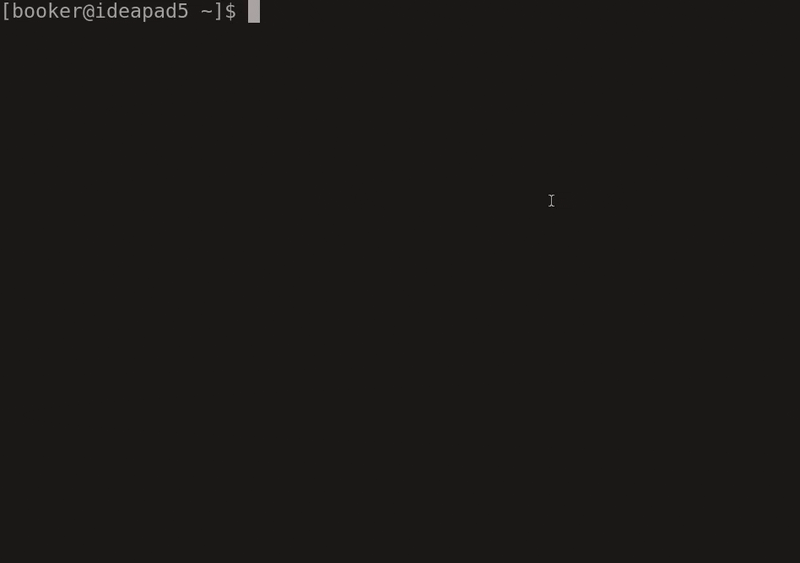

# dyes

**dyes** is a .NET tool for working with colors. You can convert colors to
different notations, copy them to clipboard or see how they look inside your terminal.

Here it is in action:



## Installation

Installation is available via [NuGet](https://www.nuget.org/packages/dyes). You need .NET 5 to use this tool.

Run this command:

```
dotnet tool install --global dyes
```

After successful install **dyes** should be in your path.

## Usage

Supported colors:
Notation | Color
--- | ---
hex | ffee12, acf, #ffee12, #ACF
rgb | rgb(0, 0, 0), rgb(20 40 60)
hsl | hsl(12, 24%, 48%), hsl(12 24% 48%)
hsluv | hsluv(12, 24%, 48%), hsluv(12 24% 48%)
hpluv | hpluv(12, 24%, 48%), hpluv(12 24% 48%)

Always put colors in quotes. Mosts shells treat **#**, **(** and **)** symbols as part of their syntax and will fail to parse your command.

To convert color to a different notation, use:

```bash
dyes convert <notation> <color>
```

To copy color to your clipboard, use:

```bash
dyes copy <color>
```

To view color in terminal, use:

```bash
dyes view <color>
```

For color inspection to work properly your terminal needs to support [TrueColor](<https://en.wikipedia.org/wiki/Color_depth#True_color_(24-bit)>), run:

```bash
dyes check-truecolor-support
```

Examples:

```bash
dyes convert rgb ffaabb
dyes convert hex 'rgb(100 20 50)'

dyes copy 'hsl(120, 75%, 50%)'

dyes view 'hpluv(12 24% 48%)'
```

You can combine multiple commands with piping, for example in bash:

```bash
dyes convert <notation> <color> | dyes copy
dyes convert <notation> <color> | dyes view
dyes view <color> | dyes copy
```

## License

Distributed under the MIT License. See [LICENSE](LICENSE) for more information.

## Contributing

If you find a bug or anything feels off, feel free to submit an issue or pull request.

Any contributions are greatly appreciated.
